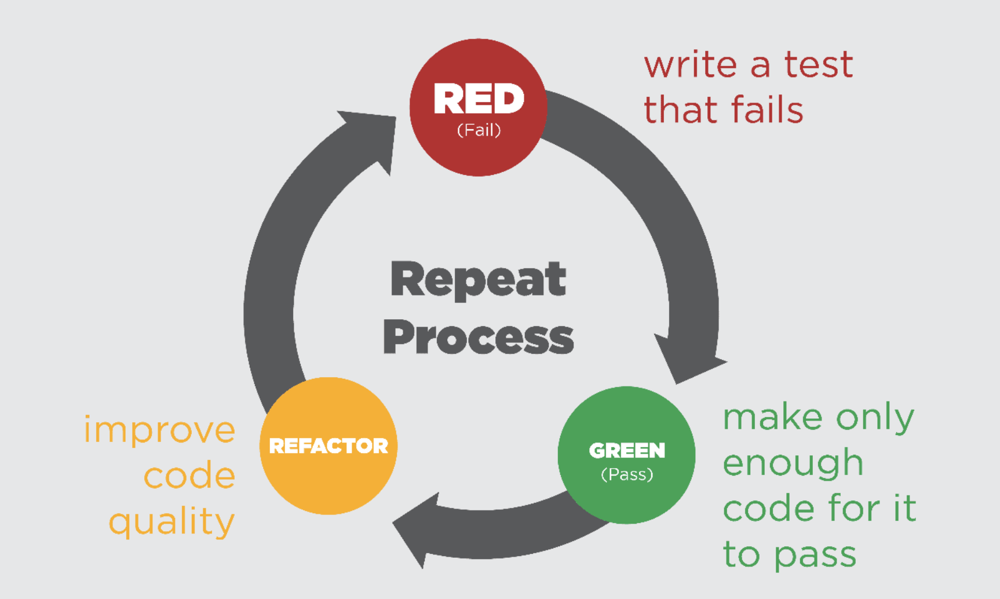
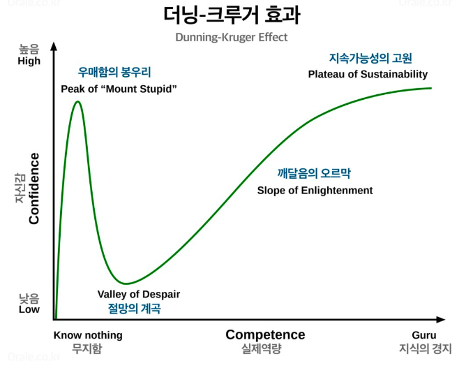
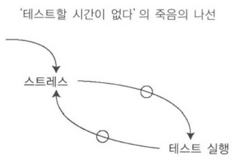

# TDD(Test Driven Development)

TDD란, Test Driven Development의 약자로 [켄트 벡(Kent Beck)](https://substack.com/@kentbeck)이 1999년 [익스트림 프로그래밍](https://en.wikipedia.org/wiki/Extreme_programming)의 일부로 제안한 소프트웨어 개발 방법론이다.

TDD는 우리 말로 **테스트 주도 개발**이라고 하며 의미 그대로 **개발하려는 기능에 대한 테스트 코드를 먼저 작성하고 해당 테스트를 통과하는 코드를 작성**하므로써 **테스트가 개발을 주도**하는 방식의 **소프트웨어 개발 방법론**이다.

켄트 벡은 이 개발 방법론을 초기에는 **Test First Development(TFD, 테스트 우선 개발)** 이라고 불렀으나 **First의 경우 Last라는 명백한 반의어**가 있었기 때문에 **반의어가 모호한 TDD**라고 부르기로 했다.

그러면서 **"테스트 주도 개발을 하지 않을 거라면 추측 주도 개발을 할 거냐"** 는 농담을 했다고 한다.

때문에 간혹 테스트를 작성하는 행위 자체를 TDD라는 용어로 사용하는 경우도 있는데, 켄트 벡이 TDD로 명명한 이유가 그 자체로 **테스트를 나중에 작성하는 것과는 차별을 두려고 한 것**이므로 테스트를 먼저 작성하지 않고 그저 **테스트를 작성하는 행위 자체를 TDD라고 하는 것은 적절하지 않다.**

# TDD Cycle

출처: <a href="https://www.icterra.com/tdd-is-not-about-testing-but-the-design/">https://www.icterra.com/tdd-is-not-about-testing-but-the-design/</a>
  

위 그림은 TDD 개발 싸이클을 표현한 것이다.

RED(Fail) → GREEN(Pass) → REFACTOR(Refactoring) 순으로 계속 반복 순환하는 것을 확인할 수 있다.

RED(Fail): 처음에는 실패하는 아주 작은 테스트를 작성한다. 처음에는 컴파일조차 되지 않을 수 있다.  
GREEN(Pass): 테스트를 통과만 하는 아주 간단한 코드를 작성한다.(실제 동작하는 로직 없이 하드코딩으로 통과만 하도록 작성)  
REFACTOR(Refactoring): GREEN에서 작성한 테스트를 통과만 하는 아주 간단한 코드를 해당 논리 흐름 그대로 실제 동작하도록 작성한다. 이 때 작성하는 코드는 잘 작동하고 테스트를 통과하며 보기 좋고 이해하기 쉬운 코드로 리팩토링 한다.
만약 이 과정 중 실패 케이스를 추가로 발견한 경우 다시 RED로 돌아가서 동일한 순서로 반복하여 잘 작동하는 깨끗한 코드를 작성한다.
테스트를 먼저 작성해야 하는 이유
결론 부터 이야기 하면 TDD를 하는 궁극적인 목적은 테스트가 아니라 **"Clean Code That Works"** 즉, "작동하는 깨끗한 코드"이다.

잘 작동하는 깨끗한 코드로 개발하기 위해 TDD를 하는 것이다.

켄트 벡은 자신의 저서 테스트 주도 개발(TDD)에서 "TDD의 아이러니 중 하나는 TDD가 테스트 기술이 아니라는 점이다. TDD는 분석 기술이며, 설계 기술이기도 하다. 사실 개발의 모든 활동을 구조화하는 기술이다."라고 이야기 하고 있다.

즉, TDD는 단순히 내가 개발한 기능을 테스트하는 것이 아니라 내가 개발할 기능의 요구사항을 분석하고 설계하고 구조화하여 잘 작동하는 깨끗한 코드로 개발할 수 있도록 한다는 것이다.
 
 
### 1. 작동하는 깨끗한 코드로 이끈다.
계속 이야기하고 있는 "작동하는 깨끗한 코드"란 보기 좋은 코드, 이해하기 쉬운 코드 등 여러 의미가 있겠지만 가장 핵심적인 의미 한 가지만 고르자면 "변경이 쉬운 코드"일 것이다.  
TDD로 개발하면 작동하는 깨끗한 코드, 즉 변경이 쉬운 코드를 작성할 수 있다.  
테스트 주도 개발이라는 것은 어쩌면 테스트가 변경이 용이한 작동하는 깨끗한 코드로 이끌도록 주도한다는 것이기도 하다.
 
 
### 2. 느슨한 결합을 만든다.
앞에서 테스트 주도 개발은 작동하는 깨끗한 코드로 이끈다고 했다.  
소프트웨어 설계에서 말하는 [느슨한 결합(Loose Coupling)](https://en.wikipedia.org/wiki/Loose_coupling)이라는 것이 있는데, 그 의미를 요약하면 다음과 같다.

"시스템의 구성 요소(Component)가 서로 약하게 연관되어 관계를 떼어낼 수 있고, 그 때문에 한 구성요소에 변화가 생겼을 때 다른 구성 요소의 성능이나 존재에 최소한의 영향을 끼치는 상태"라고 요약할 수 있다.  
"시스템의 구성요소가 다른 구성요소의 정의에 대해 많은 지식이 없어도 사용할 수 있는 상황"을 말한다.  
전자에서는 구성 요소 간에 서로 의존하는 정도를 이야기 하는 것이라면, 후자는 약간 비슷한 맥락일 수도 있지만 서로 동립적인 개체로써 결합도가 낮은 상황을 의미한다.  
위에서 설명한 느슨한 결합이 의미하는 것은 시스템의 구성 요소간의 결합도가 낮아 코드를 변경하려고 할 때 너무 복잡하거나 어렵지 않은 유연한 상태이다.  

결론적으로 소프트웨어를 설계할 때에는 시스템의 구성 요소간의 결합의 정도가 낮게 설계해서 코드의 변경이 쉽도록 하는 것이 좋은데, 테스트를 먼저 작성하면 요구사항을 분석하고 설계하는 과정에서 구성 요소간 결합이 강한지 약한지 알 수 있고 테스트 과정에서도 REFACTOR 단계에서 결합이 강한 부분을 발견하고 수정할 수 있기 때문에 결합도가 낮은 유연한 소프트웨어를 설계하고 개발할 수 있도록 해준다.

> 
테스트를 작성하기 쉽지 않다면, 그것은 테스트가 아니라 설계에 문제가 있다는 신호이다.
  
> 
결합도가 낮고 응집성이 높은 코드는 테스트하기 쉽다.
  
> 
 < "익스트림 프로그래밍" > 

 

### 3. 잘못을 일찍 깨달을 수 있다.
먼저 전형적인 폭포수(Water Fall) 방식인 분석→ 설계 → 구현→ 테스트→ 오픈 순으로 개발하는 방식은 긴 시간에 대한 추정이 기저에 깔려 있다.  
예를 들면 분석에 몇 개월을 쓰고 또 설계에 몇 개월을 쓰며 구현 및 테스트에는 또 몇 개월을 쓴다.  
정해진 기한 안에 제한되고 부족한 정보만을 가지고 소요될 시간을 추정한다는 것인데, 만약 개발 기한이 정해져 있는 상황인데 분석과 설계가 모두 끝나고 구현 또는 테스트를 진행하다가 분석/설계가 잘못되었다는 것을 알게 되었다면 다시 뒤로 돌아갈 수 있을까?  
가능은 하겠지만 이 것은 매우 큰 비용이 들것이고 지금까지 한 수고가 헛수고가 될 가능성이 높아진다.  
우리는 분석/설계를 하면서 이미 발생할 문제들을 알고 있고, 이해하고 있다고 착각한다.  
하지만 실제로는 아는 것이 없을 때, 이런식으로 문제가 없고 모두 이해했다고 확신을 갖을 가능성이 높다.

출처: <a href="https://orale.co.kr/%EB%8D%94%EB%8B%9D-%ED%81%AC%EB%A3%A8%EA%B1%B0-%ED%98%84%EC%83%81/">https://orale.co.kr/%EB%8D%94%EB%8B%9D-%ED%81%AC%EB%A3%A8%EA%B1%B0-%ED%98%84%EC%83%81/</a>

위 그림은 더닝 크루거 효과를 설명하는 우매함의 봉우리 그래프이다.  
더닝 크루거 효과는 기존에 알고 있는 것이 사실과 다르거나 틀리다는 것을 인지하게 되면서 겸손한 자세로 배우려는 태도를 갖게 된다는 것을 설명하는 심리학 용어로서 인지 편향 중 하나이다.  
더닝 크루거 효과를 보며 알 수 있는 것은 진짜 문제는 잘못을 늦게 깨닫는 데서 생긴다는 것이다.
아는 것이 없을 때, 문제가 없다고 확신할 확률이 높으며 그러면 잘못하게 될 가능성이 높아진다.  
누구나 잘못을 할 수는 있지만 잘못을 늦게 깨닫는다면 돌이킬 수 없게 된다.  
테스트 코드를 먼저 작성하는 것은 분석/설계를 한 직후 바로 테스트 코드를 실행해서 RED - GREEN - REFACTOR순서의 TDD Cycle을 짧은 주기로 반복하여 인지하지 못하고 있던 것들을 알게 되기 때문에 무엇이 잘못되었는 지 빨리 깨달을 수 있게 해준다.  
즉, 내가 개발하는 것은 사용하기 위함이고 테스트가 바로 개발한 것을 사용하는 것이기 때문에 테스트를 먼저 작성하는 것은 사용한다는 것을 먼저 정의하는 것이고 부담이 작은 테스트를 반복적으로 실행해가며 개발한 것을 바로 사용하도록 해서 잘못을 일찍 깨닫게 되는 것이다.
 
 
### 4. 과업을 정의하고 필요 없는 일을 제거한다.
HBR(Harvard Business Review)에 실린 <[지식 근로자의 생산성을 어떻게 끌어올릴 것인가](https://www.hbrkorea.com/article/view/atype/ma/category_id/1_1/article_no/2075/page/1)>에서 피터 드러커는 지식 근로자의 생산성을 가장 크게 높일 수 있는 방법으로 과업을 정의하고 해야 할 필요가 없는 일들을 제거하는 것이라고 말했다.

이와 비슷한 것이 요즘 많은 조직에서 도입하는 OKR 역시 낭비를 줄이고 조직의 성과를 달성하기 위해 목표를 명확히 하는 것이다.

프로그램을 만들 때도 마찬가지로 목표를 명확히 해야 시간을 낭비하지 않을 수 있다.

테스트를 먼저 작성한다는 것은 프로그램이 무엇을 해야 하는 지 명시적으로 정의하는 것이다.

이런 행위는 내가 무엇을 아는 지, 모르는 지 인지하게 만든다.

이렇게 모르는 것을 인지하고 집중하므로써 위에서 이야기한 더닝-크루거 효과 처럼 '무지함'을 벗아나 '깨달음'으로 갈 수 있다.

> 
'아는 것에서 모르는 것으로'는 우리가 어느 정도의 지식과 경험을 가지고 개발을 시작한다는 점, 개발 하는 와중에 새로운 것을 배우게 될 것임을 예상한다는 점 등을 암시한다.
  
> 
이 두 가지를 합쳐보자. 
  
> 
우리는 아는 것에서 모르는 것으로 성장하는 프로그램을 갖게 된다.

> 
 < "테스트 주도 개발" > 

위에서 테스트 주도 개발의 저자 켄트 벡은 '성장하는 프로그램'이라는 은유를 했다.

성장의 핵심은 학습이며 효과적인 학습의 방법 중 '시험 효과(Testing Effect)'라는 것이 있다.

즉, 같은 것을 반복해서 여러 번 공부하는 것 보다 한 번 공부하고 여러 번 반복해서 시험을 보는 것이 더 효과적이라는 것이다.

그 이유는 뇌와 관련이 있는데 연구에 따르면 우리의 뇌는 어떤 것을 계속 집어 넣으려고 하는 것 보다는 집어 넣은 것을 반복해서 떠올리려고 할수록 기억이 오래 간다고 한다.

이렇듯 테스트는 학습에 매우 효과적인 도구이다.

모든 시스템을 다 만들고 나서 오픈 전에 테스트하는 것이 아니라 부담이 적은 작은 테스트를 여러 번 반복해서 실행하다 보면 잘 모르고 있거나 잘못 알고 있는 점을 발견하고 그 것을 초기에 바로잡는 방향으로 시간을 사용할 수 있게 하고 이는 나중에 생기는 문제에 대한 불안을 낮출 수 있다.
 
 
### 5. '테스트할 시간이 없다'는 죽음의 나선에서 벗어날 수 있다.
   
<테스트 주도 개발>에스는 '테스트할 시간이 없다'의 죽음의 나선을 보여준다.  
 

출처: < "테스트 주도 개발" > 
  
 
> 
스트레스를 많이 받으면 테스트를 점점 더 뜸하게 한다.
  
> 
테스트를 뜸하게 하면 당신이 만드는 에러는 점점 많아질 것이다.
  
> 
에러가 많아지면 더 많은 스트레스를 받게 된다.

> 
 < "테스트 주도 개발" > 

보통 "테스트할 시간이 없다"라고 말하는 동료는 또 아래와 같이 말한다.
> "포스트맨(Postman)으로 테스트 하고 있다."

동료가 말한 테스트 하고 있다는 말은 UI 도구를 이용한 수동 테스트를 하고 있다는 것이다.  
프로젝트 초반에는 코드가 얼마 되지 않아 복잡하지 않기 때문에 수동으로 테스트하는 것만으로도 충분하다.
하지만 프로그램이 계속 개발되며 커질수록 코드는 점점 늘어나며 복잡해지고 이로 인해 한 부분을 수정하면 다른 부분에서 문제가 생기고 또 그 부분을 고치면 또 다른 곳에 문제가 생기며 이 부분을 고치면 또 다른곳에 문제가 발생하여 장애로 이어질 수도 있다는 두려움을 갖게 된다.  
그러다 보면 실제 개발하는 시간 보다는 수정한 코드가 다른 곳에 문제를 발생시키는 지에 대한 영향도 분석에 더 많은 쓰게 된다.  

> 
만약 당신이 코드를 자신 있게 변경할 수 없다면, 당신의 테스트는 충분하지 못하다는 것을 의미한다.
  
> 
지나치다라는 신호는 당신이 코드를 변경할 때, 코드를 변경하는 것 보다 테스트를 변경하는 노력이 더 많이 든다고 느낄 때를 말하는 것이다.
  
> 
 < "TDD는 죽었는가?" > 

수동 테스트는 시간이 지나고 범위가 늘어남에 따라 인간의 인지 능력의 한계와 망각으로 인해 테스트 케이스를 모두 기억할 수 없게 되며, 누락이 발생하기 시작한다.  
게다가 코드는 거의 대부분 의존성을 가지기 때문에 하나를 고치면 예상하지 못하는 곳에서 오류가 발생하는 경우가 많다.  
이런 경우 수동으로 테스트하기 매우 어렵고 복잡하기 때문에 결국 개발하는 시간을 테스트하며 문제가 되는 부분을 찾는 데 다 쓰게 되고 찾아서 수정한다고 해도 또 다른 부분에 문제가 발생하는 악순환에 빠지게 되며 결국 코드를 신뢰할 수 없게 된다.  
테스트를 작성하는 것은 초반에 비용이 비교적 더 들긴 하지만 결국 장기적으로 봤을 때, 테스트 코드를 작성하는 편이 유지 보수, 확장 등의 추후 개발에도 좋은 것 같다는 생각이 든다.  
그렇다면 테스트는 언제 작성하는 것이 좋을까? 일단 작동하는 코드를 만들어 놓고 나중에 테스트를 작성해도 되지 않을까?  
하지만 이미 작동하는 기존 코드는 테스트를 작성하기가 더 어렵다.  

>
> 
테스트를 언제 작성하는 것이 좋을까? 테스트 대상이 되는 코드를 작성하기 전에 작성하는 것이 좋다.
  
> 
코드를 작성한 후에는 테스트를 만들지 않을 것이다.

> 
(중략)

> 
테스트를 먼저 하면 스트레스가 줄고, 따라서 테스트를 더 많이 하게 된다. 

> 
 < "테스트 주도 개발" > 

> 
작동하지 않는 코드를 작성한 사람을 신뢰하기는 힘들다.
  
> 
작동하는 깨끗한 코드를 작성하고 자동화된 테스트로 의도를 드러내면, 팀원들이 당신을 신뢰할 근거가 생긴다.

> 
 < "익스트림 프로그래밍" > 
  

### 참고  
https://tech.kakaopay.com/post/implementing-tdd-in-practical-applications/

https://yozm.wishket.com/magazine/detail/2308/

https://www.hbrkorea.com/article/view/atype/ma/category_id/1_1/article_no/2075/page/1

https://yozm.wishket.com/magazine/detail/1926/

https://mangkyu.tistory.com/182

http://cloudrain21.com/test-driven-development
